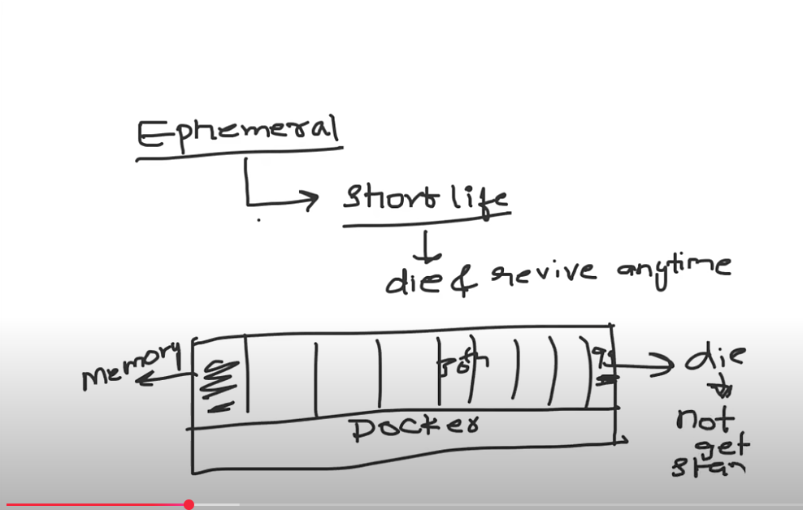

# Day 30 Introduction to K8s

Docker is container platform & K8 is container orchestration platform - Textbook definition

### <u>Practical Understanding of K8s</u> ###

One of the things we know about containers is that they are ephemeral in nature meaning they are short lived. In easier terms it means containers can die and revive anytime

As shown in diagram , there is VM platform on top of which we have docker applciation running which is creating 100s of container.
Now since container uses resources from host operating system and assume that first container is consuming a lot of resources which is causing container 99 to run out of resources and die. Or maybe that container 1 is taking so much resources that it doesn't let container 99 to be scheduled.Hence if container doesn't have enough resources of if container image is not pulled from registry , container immediately dies which is why they are short lived

Now how exactly we ran into this problem or why this is problem ?

Because there is only one host as we can see in image . In that host kernel , each process has priority. There is priority assigned to each process and since container is already running there is process ID allocated to it. Now since there is lot of memory allocated to this process and there is no more memory left to create new process , container 100 doesn't get created or immediately dies.Because there is only one host on top of which docker is running and that host itself is running out of resources which is leading to our inability of creating new container/ container dying. Hence we have learnt one problem here which is **<u>single host</u>**

# Day 30 Introduction to K8s

Docker is container platform & K8 is container orchestration platform - Textbook definition

### <u>Practical Understanding of K8s</u> ###

One of the things we know about containers is that they are ephemeral in nature meaning they are short lived. In easier terms it means containers can die and revive anytime

As shown in diagram , there is VM platform on top of which we have docker applciation running which is creating 100s of container.
Now since container uses resources from host operating system and assume that first container is consuming a lot of resources which is causing container 99 to run out of resources and die. Or maybe that container 1 is taking so much resources that it doesn't let container 99 to be scheduled.Hence if container doesn't have enough resources of if container image is not pulled from registry , container immediately dies which is why they are short lived

Now how exactly we ran into this problem or why this is problem ?

Because there is only one host as we can see in image . In that host kernel , each process has priority. There is priority assigned to each process and since container is already running there is process ID allocated to it. Now since there is lot of memory allocated to this process and there is no more memory left to create new process , container 100 doesn't get created or immediately dies.Because there is only one host on top of which docker is running and that host itself is running out of resources which is leading to our inability of creating new container/ container dying. Hence we have learnt one problem here which is **<u>single host</u>**

